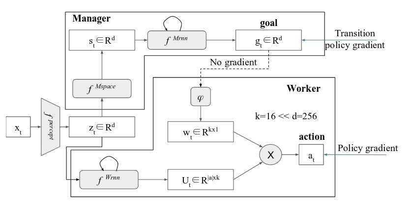

# FeUdal Networks for Hierarchical Reinforcement Learning
---
### Authors:

  Alexander Sasha Vezhnevets, Simon Osindero, Tom Schaul, Nicolas Heess, Max Jaderberg, David Silver, Koray Kavukcuoglu

### Summary:

- Introduce FeUdal Networks (_FuNs_).

- Two levels of hierarchy:
  1. _Manager_ (top level module): sets goals at a lower temporal resolution. It receives its learning signal from the environment alone.
  2. _Worker_ (low level module): operates at a higher temporal resolution and produce primitive actions, conditioned on the goals received from the _Manager_. It is motivated by an intrinsic reward.

  

- The figure above represents the architecture of the _FuN_ model. Both modules share a _perceptual module_ which takes the current observation _xt_ and outputs an intermediate representation _zt_.

- Both modules are recurrent.

- &phi; represents a linear transform mapping the goal into an embedding vector _wt_.

#### Learning:

_FuN_ is fully differentiable and it could therefore be trained end-to-end using policy gradient algorithms operating on the actions taken by the _Worker_ and propagating the gradients coming from the _Worker_ back to the _Manager_. The authors, however, explain that this standard approach would _deprive Manager's goals g of any semantic meaning, making them just internal latent variables of the model._ For this reason, they propose a different training setup:

1. _Manager:_ train to predict advantageous directions in state space and to intrinsically reward the _Worker_ to follow these directions. Update rule:

  &nabla;gt = AtM &nabla;&theta;dcos(st+c-st, gt(&theta;))

 where:

AtM = Rt - VtM(xt,&theta;) is the _Manager's_ advantage function

dcos(&alpha;,&beta;) = &alpha;T&beta;/(|&alpha;||&beta;|) is the cosine similarity between two vectors

  _gt_ acquires a semantic meaning as an advantageous direction in the state space at a horizon _c_.

2. _Worker:_ the worker is trained to maximize a weighted sum of external and intrinsic rewards: _Rt + &alpha;RtI_. The intrinsic reward encourages the _Worker_ to follow the goal and is defined as:

rtI = 1/c &Sigma;i=1c dcos(st-st-i, gt-i(&theta;))

### Experiments:

The authors evaluated the approach in several environments: Montezuma's revenge, other ATARI games and DeepMind's Labyrinth environment.

### Results:

_FuN_ achieves very good performance in most of the tested environments. However, one of the most interesting results, in my opinion, occurs when testing the model in _Montezuma's revenge_.

Although the current approach is quite similar to that one proposed by _Kulkarni et al._ and summarized [here](./HierarchicalDeepReinforcementLearningIntegratingTemporalAbstractionIntrinsicMotivation.md), the goals generated by _FuN_ are very similar to those handcrafted in Kulkarni's paper. It is interesting to see that the model is capable of learning useful goals by itself.

### Future work:

 - Deeper hierarchies by setting goals at multiple time scales.
