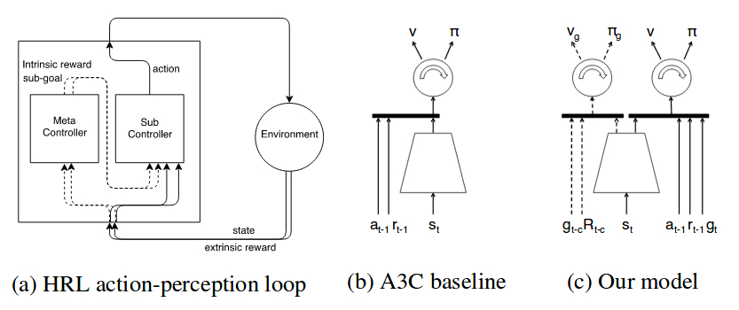

# Feature Control as Intrinsic Motivation for Hierarchical Reinforcement Learning
---
### Authors:

  Nat Dilokthanakul, Christos Kaplanis, Nick Pawlowski, Murray Shanahan

### Important Notes:

In a recent version of the paper, the authors present recent evidence about an A3C agent trained with shaped rewards and intrinsic motivation capable of achieving the same performance they reported in Montezuma's revenge. These results raised question about the benefit of the proposed hierarchical approach given that the decision made by the _Meta-Controller_ may not contribute to the success of the agent. It may be that the reported results come more from the use of additional auxiliary rewards than from the architecture itself. 

### Summary:

- Considering that one of the main problems in HRL is to find useful and generalizable skills, the authors propose the ability to control features of the environment as an inherently powerful skill for an agent to have.

- The paper presents an agent which is intrinsically motivated to control aspects of its environment.

- The agent is inspired by FeUdal RL (discussed [here](./FeUdal.md)) and shares its two-level hierarchy:

  1. _Meta-Controller:_ learns to maximize _extrinsic_ reward and tells the _Sub-Controller_ which feature of the environment it should control.
  2. _Sub-Controller:_ receives an _intrinsic_ reward for successfully changing the given feature together with an _extrinsic_ reward from the environment.

- The main difference between this paper and the papers from _Kulkarni et al._ [here](./HierarchicalDeepReinforcementLearningIntegratingTemporalAbstractionIntrinsicMotivation.md) and _Vezhnevets et al._ [here](./FeUdal.md) will be about the way the subgoals are designed and incorporated in the learning process.

### Model:

  

The _Sub-Controller_ is responsible of choosing actions and interacting with the environment. The _Meta-Controller_ operates at a lower temporal resolution and influences the behavior of the _Sub-Controller_ by setting subgoals _gt_. The _Metal-Controller_ also provides an intrinsic reward signal to the _Sub-Controller_ for successfully completing the subgoal. The behavior of the _Sub-Controller_ is then biased towards completing the provided subgoals while the _Meta-Controller_ learns to select sequences of goals which maximize the cumulative extrinsic reward.

- The authors propose and evaluate two methods for delivering subgoals to the _Sub-Controller_ and computing the _intrinsic_ reward. In both methods, the proposed goal _gt_ is given as a one-hot vector representing which "pixel patch" or which "feature map" should be modified.

  1. Pixel control: ability to control a given subset of pixels in the visual input. The authors discretized the input image into smaller "patches" and define the _intrinsic_ reward as the difference between two consecutive frames. The _Sub-Controller_ is then encouraged to maximize the change in values of pixels in the given patch relative to the entire screen.

  2. Feature control: ability to control the activation of specific neurons in the model. The _intrinsic_ reward is given as a feature selectivity measure on the second convolutional layer. This approach should give the model a more "flexible and abstract" control of the environment.

### Experiments:

They evaluated on different Atari games and compared with the Feudal Network and Option-Critic architectures. The authors present different type of experiments in order to evaluate different characteristics of the proposed architecture.

### Results:

  - It seems like introducing a certain proportion of _intrinsic_ reward in the _Sub-Controller_ has a positive effect in sparse reward environments.

  - Pixel-controlled agents learn faster than feature-controlled ones. However, this seems to happen because the model needs to identify useful features before the influence of the _Meta-Controller_ becomes meaningful. Once it does, the generated subgoals are of higher quality than the hard-coded ones.

  - The authors had some problems tuning the length of the BPTT roll-outs for the LSTM layers. Longer roll-outs performed better in some environments like Montezuma's revenge, but deteriorated performance in others like Frostbite.

  - The model obtained similar performance in Montezuma's revenge when compared to FeUdal Networks but learning much more quickly. It doesn't perform as well in other environments.

### Future work:

  - Incorporate termination conditions for the sub-policies, thus allowing the instructions from the _Meta-Controller_ to be of variable length and more temporally precise.
