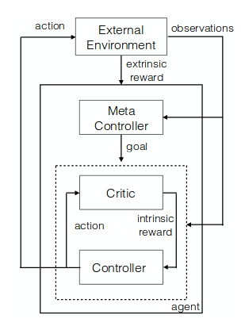

# Hierarchical Deep Reinforcement Learning: Integrating Temporal Abstraction and Intrinsic Motivation
---
### Authors:

  Tejas D. Kulkarni, Karthik R. Narasimhan, Ardavan Saeedi, Joshua B. Tenenbaum

### Summary:

- Hierarchical-DQN (h-DQN): framework for integrating hierarchical value functions with intrinsically motivated deep reinforcement learning.

- Agent is motivated to solve intrinsic goals (by learning skills) to improve exploration. These goals improve exploration and help alleviate sparse feedback problem. Moreover, goals can also help to significantly constrain the exploration space.

- Learning modules working at different time-scales. Two levels of hierarchy:
  1. _Meta controller_ (top level module): takes in the state and picks a new goal.
  2. _Controller_ (low level module): uses both the state and the provided goal to select primitive actions either until the goal is reached or the episode terminates.

  - _Critic_: There exists an internal critic responsible for evaluating whether the goal has been reached or not. An appropriate reward is given to the _controller_ based on its actions.

- Objective functions:
  1. _Meta controller_: to maximize the cumulative extrinsic reward received from the environment.
  2. _Controller_: to maximize the cumulative intrinsic reward provided by the critic.

  

- The authors use the _DQN_ framework to learn policies for both modules: Q1 and Q2. The main difference, apart from the reward, is the transitions generated by the policies:

  1. _Meta controller_ (Q2): transition = (_st, gt, ft, st+N_), where _f_ represents the external reward function and _N_ denotes the number of time steps the controller employs to reach the current goal. These transitions run at a slower time-scale.
  2. _Controller_ (Q1): transition = (_st, at, gt, rt, st+1_).

### Experiments:

I am going to focus on the experiments they performed on the Atari game _Montezuma's Revenge_. This environment is challenging because it presents sparse delayed rewards.

- In their setup, the authors built a _custom object detector_ which provides _plausible object candidates_. These objects are then used as goals for the _Controller_. This object detector can be seen as a "hardcoded" _customized_ module which provides the location of previously defined objects in the image like doors, ladders and keys.

- One of these objects is chosen as a goal by the _Meta controller_ and passed on to the _Controller_ in the form of a binary mask of the goal location in image space.

- The internal critic is defined in the space _<entity1, relation, entity2>_. It basically verifies if _entity1_ has reached _entity2_. One of this entities is provided in the form of a goal and the other one is selected by the agent (_Controller_).

### Results:

h-DQN easily outperforms standard DQN approaches in the tested environments. The model gradually learn to select proper goals thus being able to solve the first stage in _Montezuma's Revenge_.

### Future work:

- In order to scale-up and being able to solve the entire game, the system should be able to automatically identify or discover objects in the environment (new goals).

- Memory is required for the model to remember the sequence of actions/goals it has performed.

- An additional hierarchical level could be introduced below the current _Controller_ in order to make use of _Skills_ to solve the current problem (to reach the current goal).
